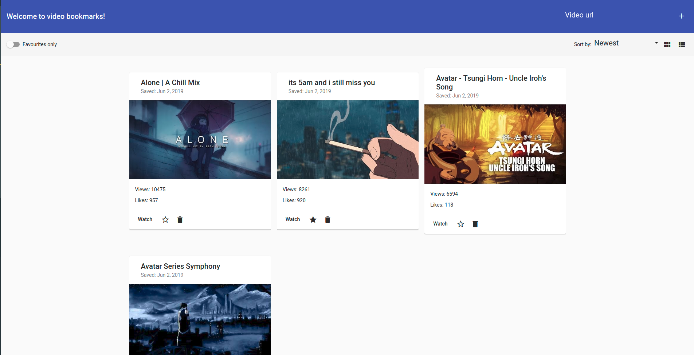

# VideoBookmarks

> Store your favourite videos from different video services!

## Development server

Run `ng serve` for a dev server. Navigate to `http://localhost:4200/`. The app will automatically reload if you change any of the source files.

## Build

Run `ng build` to build the project. The build artifacts will be stored in the `dist/` directory. Use the `--prod` flag for a production build.

### Technologies 🔧 
+ [Angular](https://angular.io/)
+ [Angular material](https://material.angular.io/)

#### Meta
Karol Waliszewski - [github](https://github.com/Karol-Waliszewski) - [karolwaliszewski@gmail.com](mailto:karolwaliszewski@gmail.com)

https://github.com/Karol-Waliszewski/Video-bookmarks